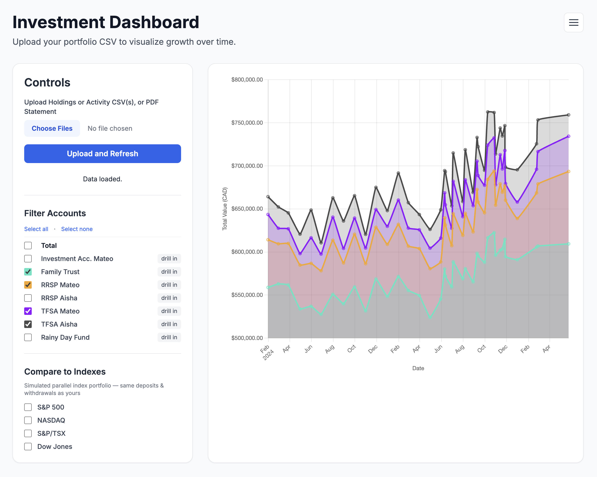
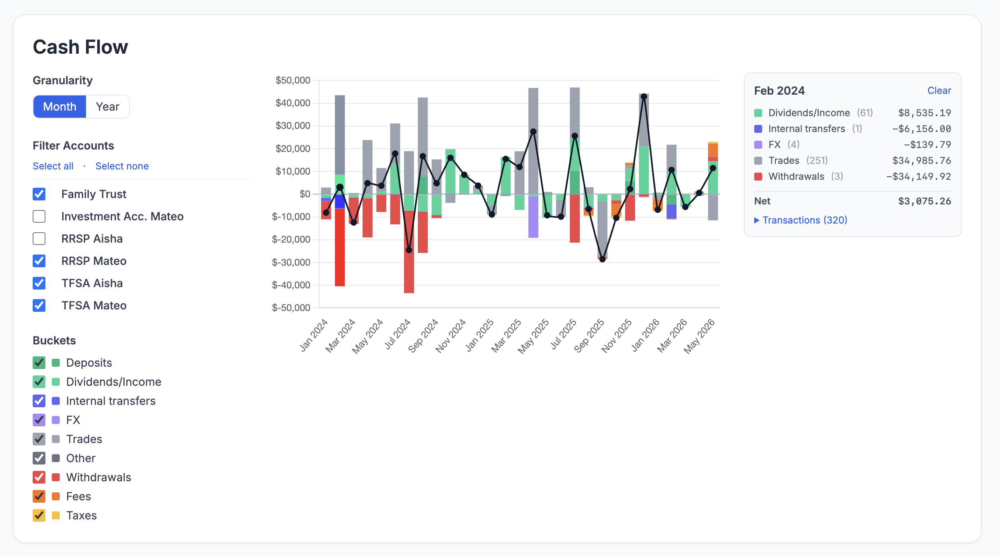

# Investment Tracker





A small local web app to track a multi-account **RBC Dominion Securities** portfolio against market indexes, honestly accounting for deposits and withdrawals. It only ingests RBC Dominion Securities CSV exports and PDF statements — no other broker is supported.

## Features

- **Works with RBC Dominion Securities** — built around the CSV exports and monthly PDF statements their site produces, no manual reshaping required.
- **Direct upload of broker CSVs or PDF statements** — drop in **Holdings** snapshots (positions and balances per account), **Activity** statements (deposits, withdrawals, dividends, internal transfers), or monthly **PDF statements** that bundle both. The file type is auto-detected and ingested; sources are idempotent so the same period from CSV and PDF can be uploaded without duplicating.
- **Multi-account tracking** — every account (RRSP, TFSA, non-registered, joint, etc.) is tracked separately and summed to a portfolio total.
- **Honest index comparison via parallel-portfolio simulation** — compares against S&P 500, NASDAQ, S&P/TSX, and Dow Jones by simulating an index portfolio that "buys" and "sells" on every external cash flow you made. The result is a direct dollar-for-dollar line on the same chart, so deposits and withdrawals don't fake out the comparison the way percentage-return charts do.
- **Per-account drilldown** — click "drill in" beside any account to rescope the index comparison to that account alone (internal transfers in/out of that account are then treated as external cash flows).
- **USD ↔ CAD FX handling** — USD trades are converted using the rate embedded in the broker's description line when present, falling back to a daily Yahoo Finance USDCAD quote.
- **Cash flow classification** — every activity row is tagged (external in/out, internal transfer, income, trade, fx, other). Unrecognized rows surface in a dedicated panel so nothing silently vanishes from the simulation.
- **Data freshness diagnostics** — a freshness strip, an activity-coverage histogram, and gap warnings call out stale holdings, missing months, or activity entries that postdate your last holdings snapshot.
- **Local-first storage** — everything lives in a single SQLite file (`investments.db`); every raw upload is archived under `uploads/archive/YYYY/MM/` for auditability.
- **Chart annotations at cash flow dates** — vertical markers on the chart; hover for the amount, direction, and account.
- **Agent-friendly** — because the data is just a local SQLite database, you can point an agentic harness (e.g. Claude Code) at `investments.db` and ask freeform questions about your portfolio — performance per account, fees over time, dividend yield by year, etc. — without writing a query layer yourself.

## Running

```sh
npm install
npm start
```

Opens http://localhost:3000 in your browser.

## Usage

The tool is fed by files you export from RBC Dominion Securities — there is no manual data entry and no integration. You have two paths: live CSV exports (best for ongoing weekly/monthly updates) or monthly PDF statements (best for backfilling history). Mix freely — the database is keyed so duplicates across sources merge.

### Option A — CSV exports (ongoing updates)

Log in to the RBC Dominion Securities site and grab two exports:

- **Holdings CSV** — go to **Account Holdings** (the page that lists positions per account). Use the export / download button on that page. This is a snapshot of *what you own* and what it's worth, on the day you export it.
- **Activity CSV** — go to **Activity** (the page that lists deposits, withdrawals, trades, dividends, transfers). Use the export / download button on that page. Choose as wide a date range as the site offers; the ingester is idempotent so overlapping ranges are fine to re-upload later.

The export buttons live in slightly different spots depending on which version of the DS site you're on, but each page has one.

### Option B — Monthly PDF statements (historical backfill)

Each RBC monthly PDF statement contains both the holdings snapshot (as of month-end) and that month's activity — equivalent to one Holdings + Activity CSV pair per account per month. PDFs are the fastest way to seed years of history that predate your CSV exports.

To download them from RBC DS:

1. Click **Documents** in the top navigation.
2. Click **Account Documents**.
3. Click **Statements**.
4. Pick an account, filter by date range, and download each monthly PDF.
5. **Repeat for each account** — RBC scopes statements to one account at a time. If you have RRSP, TFSA, joint, etc., download statements for each separately.

The parser handles all the RBC statement formats observed so far: A+ managed accounts (`A + STATEMENT`), basic accounts (`ACCOUNT STATEMENT`), and PIM registered accounts (TFSA, RRSP, RIF, FHSA). PDFs that bundle a CAD and a USD sub-statement are split automatically; USD is converted to CAD using the FX rate printed on the statement. Cash positions (which sit in the statement's CASH BALANCE section, not its asset review) are captured as `CASH`-type holdings.

### Upload into the app

Drop your files — CSV or PDF, one or many — into the upload area. The file type is auto-detected from content (PDF magic bytes vs. CSV headers), so no labelling is required. Re-uploading the same file is harmless: duplicates are skipped via unique-index constraints. Account numbers from CSV (digit-only) and PDF (hyphenated) are normalized to the same canonical form, so the same account from either source is treated as one.

### Why both kinds of data are needed

Whether sourced from two CSVs or from one PDF (which bundles both), the app needs holdings and activity together to do its main job:

- **Holdings** tells you *what your portfolio is worth right now*. Without it, the app has no portfolio value to plot.
- **Activity** tells you *every dollar that entered or left the portfolio*, plus dividends, trades, and internal transfers. Without it, the parallel-portfolio index comparison can't be honest: it wouldn't know when you deposited or withdrew, so a chart against the S&P 500 would silently treat your contributions as portfolio gains (or your withdrawals as losses).

Together they let the app draw your real portfolio value over time *and* a same-scale "what if I'd put each of those cash flows into the index instead" line — dollar for dollar on the same chart.

### Re-upload over time to see the trend

A single upload is mostly diagnostic — you'll see your current portfolio value and a list of your cash flows, but there's no trend yet. The tool gets useful when you re-export and re-upload **on a recurring basis** (e.g. once a week or once a month). Each new holdings snapshot becomes another point on the portfolio value chart, and each new activity export fills in any cash flows since the last one. After a few cycles you'll have a real time series of your portfolio against the indexes, with deposits and withdrawals correctly accounted for.

For historical depth, batch-uploading years of monthly PDF statements is the fastest path to a fully populated chart — each PDF contributes one snapshot date per account.

## Tests

```sh
npm test
```

## Architecture

- `server.js` — express bootstrap, mounts routes.
- `db.js` — SQLite connection + schema.
- `lib/` — pure logic units, each unit-tested:
  - `account-id.js`, `csv-detect.js`, `file-detect.js`, `classify.js`, `fx.js`, `archive.js`,
  - `holdings-ingest.js`, `activity-ingest.js`,
  - `pdf-extract.js`, `pdf-statement-split.js`, `pdf-statement-parse.js`, `pdf-ingest.js`,
  - `simulator.js`, `freshness.js`,
  - `migrate-account-id.js`, `normalize-account-id.js` (one-time migrations)
- `routes/` — express routers, one file per concern.
- `test/` — `node --test` test suites.

## Cash flow classification

Activity rows are classified as one of:

| Classification | Meaning | Used by simulator? |
|---|---|---|
| `external_out` | Money left the portfolio (withdrawal, wire, EFT) | yes |
| `external_in` | Money entered the portfolio | yes |
| `internal_transfer` | Move between two tracked accounts (e.g. spousal RRSP contribution) | per-account scope only; whole-portfolio ignores |
| `income` | Dividends and interest received | no (already reflected in holdings totals) |
| `trade` | Intra-portfolio Buy/Sell — no net cash effect | no |
| `other` | Anything not yet recognized | no; visible in the "Unrecognized activity" UI panel |

To refine: add more rules to `lib/classify.js` and a test in `test/classify.test.js`.

